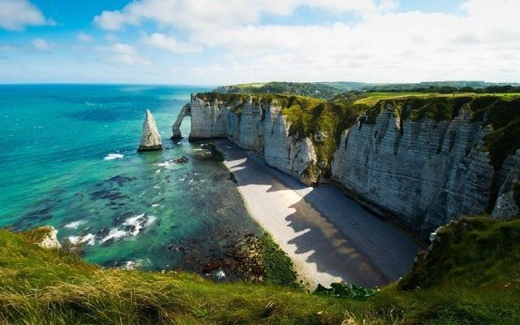
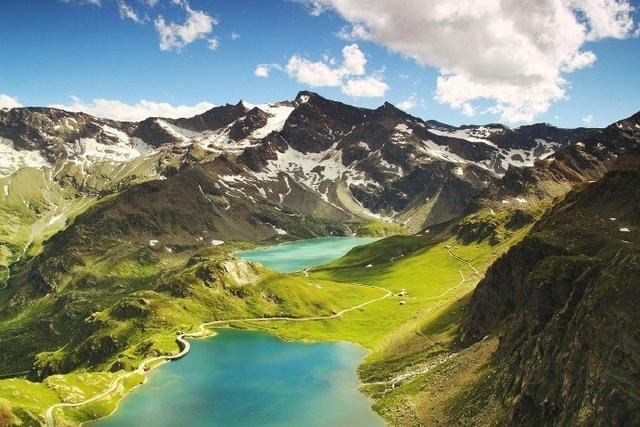

1.凡事不必苛求，来了就来了；遇事不要皱眉，笑了就笑了；结果不要强求，做了就对了；生活就是一种简单，心静了就平和了。不要去拒绝忙碌，因为它是一种充实；不要去抱怨挫折，因为它是一种坚强；不要去选择沉默，因为它是一种伤害；不要去拒绝微笑，因为它是你最大的魅力！

2.心静了，才能听见自己的内心。也许，你正狂热追求的，并非你真正想要的，只是迁就了别人或者社会；也许，你正为之苦恼，肝肠寸断的，未必是你真正想爱或者该爱的，只是一时的不甘心。坐下来，静赏花开，静观水流，心静了，自然就看清了。笑看花开，是一种宁静的喜悦；静赏花落，是一份随缘的自在。

3.人生要学会拿得起，放得下拿得起是生存，放得下是生活；拿得起是能力，放得下是智慧。有的人拿不起，也就无所谓放得下，有的人拿得起，却放不下。拿不起就庸庸碌碌，放不下就疲惫不堪。人生有太多的东西需要放下。只要我们放下那些无谓的负担，那么在人生的道路中我们就会一路坦然前行！

4.人生真正的价值不在人生的舞台上，而在我们今天扮演的角色中。过去的经历再光彩，也是一束凋谢的花朵，今天的生活虽平凡，却是一把充满生命力的种子。心静，才能心安。心浮气躁之人，做人缺乏和善，做事缺乏耐心，势必会让人生陷入僵局。克制浮躁，唯有静心。静心，需要用理智去稀释狂乱的情感，用释放囚禁的过去，用坦然去迎接不可预知的未来。让心静下来，你才能读懂自己、看清未来。

5.生活的最高境界是理解，人生的最高境界是心静。心静，就能进入一种“闭门即是深山，读书随处净土”的妙处。以静心看世界，世界便是一片充满清幽安宁的绿洲，即使有鸟蝉噪，也会感受出“林愈静山更幽”的意境来。心之性之悠悠，全身心地沉浸到明月清风之中，便有通体爽快之感。心静如水，依物随心。

6.人心越宁静，越能客观地认识世界。常常，不是没能力看透，只因心太乱。非淡泊无以明志，非宁静无以致远。静能生智，智者之所以不惑，除了学问，更重要是心静。想要把这个世界看清，先要沉淀自己的心。心乱一切乱，别让一颗小石子击碎心智。

7.人生的路，需要一步一步往前走，需要坚持不懈的努力与付出，世上本无过往不的阴影，只有过不往的心情，人生在这个世界上，必须要饱受风霜与挫折，最后才可以创造出天堂的气力，假如有谁告诉你，他用一天的时间获取了成功，那么，请你不要相信，世上本无捷径，成功从来不是偶然的。

8.生活原不苦，苦的是欲望过多；心灵本无累，累的是攫取太甚。人生的历程，就是欲壑渐少，追逐递减；命运的深层次意义，就是要学会放弃和等待，放弃一切喧嚣浮华，等待灵魂慢慢地安静。昨天再苦，都要用今天的微笑，把它吟咏成一段幸福的记忆；曾经再累，都要用当下的遗忘，让灵魂波澜不惊。

9.每一个人心里都有那么一段故事，无法述说。就只能放任那些在深夜里对自己倾述。其实，很多故事不必说给每个人听，就当做是一段记忆，伤感却也美丽。学会安静，学会独立，做个坚强的自己。

10.人生的境界，说到底，是心灵的境界。若心乱神迷，无论你走多远，你皆捕捉不到人生的本象，领略不到有韵致的风景。唯有心灵的安静，方能铸就人性的优雅。这种安静，是得失后的平和。