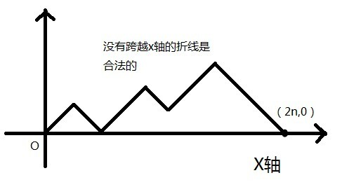
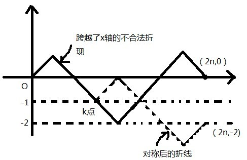

今天看到一个非常有趣的关于卡特兰数的证明方法

>1.饭后，姐姐洗碗，妹妹把姐姐洗过的碗一个一个地放进碗橱摞成一摞。一共有n个不同的碗，洗前也是摞成一摞的，也许因为小妹贪玩而使碗拿进碗橱不及时，姐姐则把洗过的碗摞在旁边，问：小妹摞起的碗有多少种可能的方式？
2.给定n个数，有多少种出栈序列？
3.一个有n个1和n个-1组成的字串，且前k个数的和均不小于0，那这种字串的总数为多少？
 
这三个问题具有相同的结构，三个问题是可以互相转化。将姐姐放碗看做入栈操作，将妹妹放碗看做出栈操作。则问题一变为问题二。将入栈操作记为1，出栈记为-1，问题2变为问题3。

问题的答案是一个著名的数列，卡特兰数。该问题的代数解法比较抽象，而运用到几何上，用图片来描述，却有让人恍然大悟的感觉。
 

事实上，可以认为问题是，任意两种操作，要求每种操作的总次数一样，且进行第k次操作2前必须先进行至少k次操作1。我们假设一个人在原点，操作1是此人沿右上角45°走一个单位（一个单位设为根号2，这样他第一次进行操作1就刚好走到（1,1）点），操作2是此人沿右下角45°走一个单位。第k次操作2前必须先进行至少k次操作1，就是说明所走出来的折线不能跨越x轴走到y=-1这条线上！在进行n次操作1和n此操作2后，此人必将到到达（2n，0）！若无跨越x轴的限制，折线的种数将为C（2n，n），即在2n次操作中选出n次作为操作1的方法数。

现在只要减去跨越了x轴的情况数。对于任意跨越x轴的情况，必有将与y=-1相交。找出第一个与y=-1相交的点k，将k点以右的折线根据y=-1对称（即操作1与操作2互换了）。可以发现终点最终都会从（2n，0）对称到（2n，-2）。由于对称总是能进行的，且是可逆的。我们可以得出所有跨越了x轴的折线总数是与从（0,0）到（2n,-2）的折线总数。而后者的操作2比操作1要多0-（-2）=2次。即操作1为n-1,操作2为n+1。总数为C（2n，n-1）。

