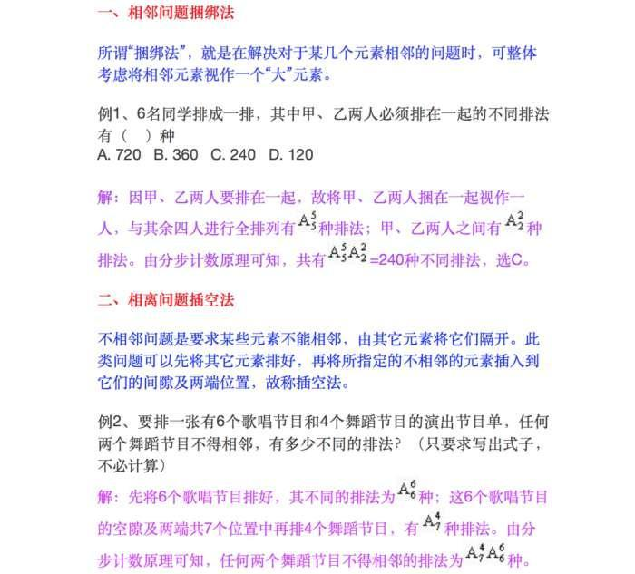
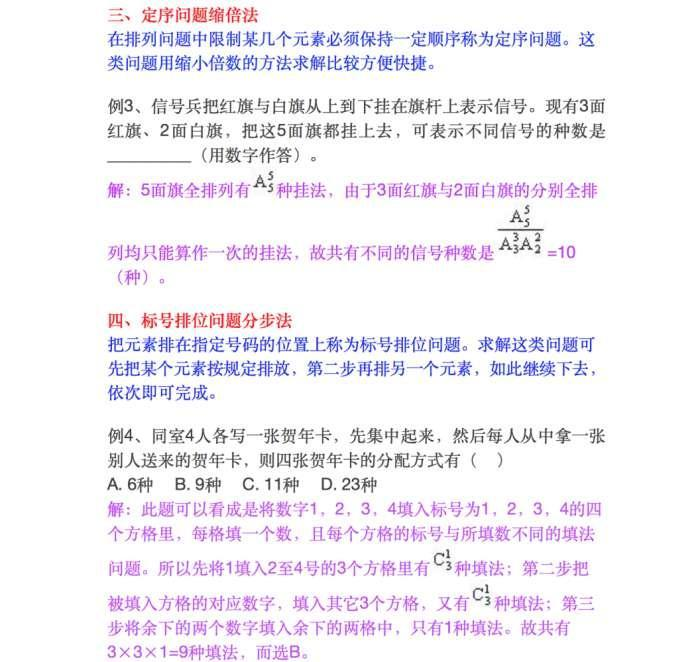
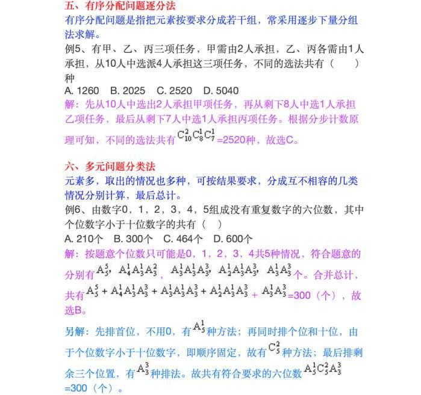
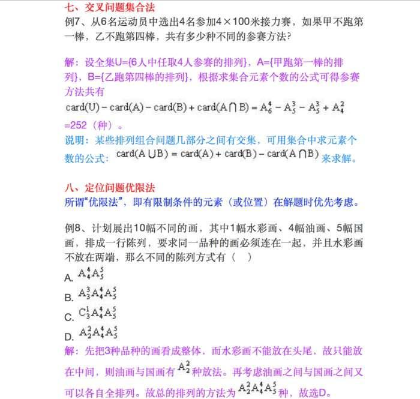
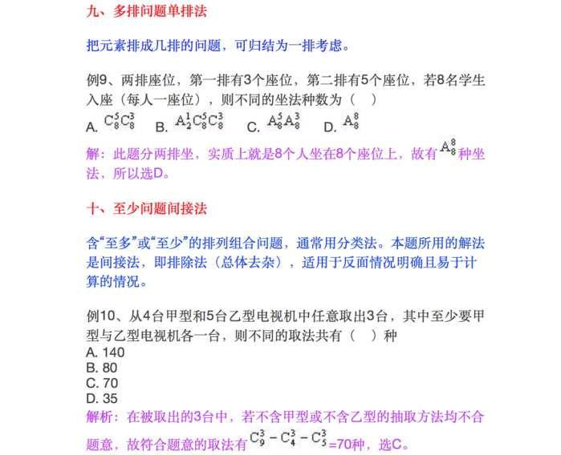
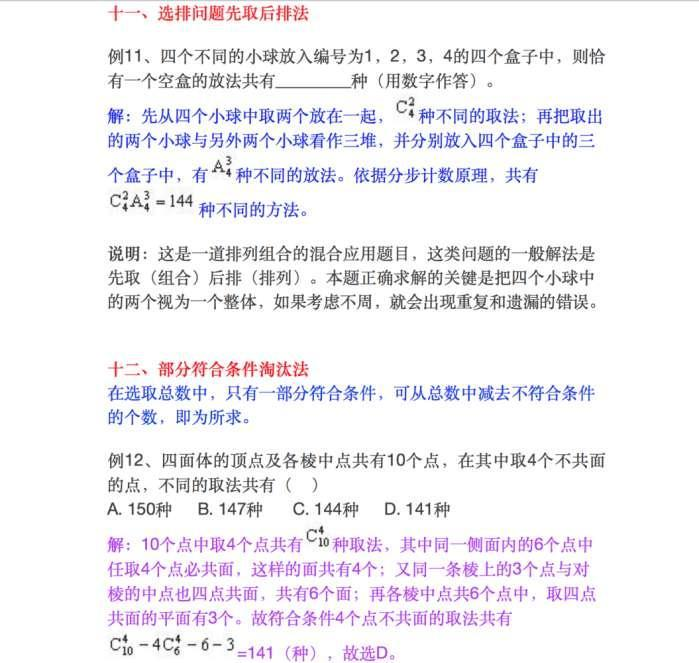

一、相邻问题捆绑法。

相邻，指相邻的多个元素；捆绑，就是把相邻的多个元素看成一个整体。

二、相离问题插空法。

相离，即不相邻，在不相邻的元素中插入其他元素。

三、定序问题缩倍法。

定序就是在排列中让几个元素保持一定的顺序，这类题目用缩小倍数的解法比较方便。

四、标号排位问题分步法。

五、有需分配问题逐分法。

六、多元问题分类法。

七、交叉问题集合法。

八、定位问题优限法。

九、多排问题单排法。

十、至少问题间接法。

十一、选排问题先取后排法。

十二、部分符合条件淘汰法。

用这种方法的话，需要同学们细心一点，分析清楚那些是符合条件的东西，哪些不符合，来进行排除。