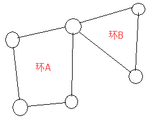

>John是一个与其他农民一样懒的人。他讨厌骑马，因此从来不两次经过一个栅栏。你必须编一个程序，读入栅栏网络的描述，并计算出一条修栅栏的路径，使每个栅栏都恰好被经过一次。John能从任何一个顶点(即两个栅栏的交点)开始骑马，在任意一个顶点结束。

>每一个栅栏连接两个顶点，顶点用1到500标号(虽然有的农场并没有500个顶点)。一个顶点上可连接任意多(>=1)个栅栏。两顶点间可能有多个栅栏。所有栅栏都是连通的(也就是你可以从任意一个栅栏到达另外的所有栅栏)。

>你的程序必须输出骑马的路径(用路上依次经过的顶点号码表示)。我们如果把输出的路径看成是一个500进制的数，那么当存在多组解的情况下，输出500进制表示法中最小的一个 (也就是输出第一位较小的，如果还有多组解，输出第二位较小的，等等)。

***==无向图==***

首先，在无向图中，要确定是否存在欧拉回路很容易：只要每个点的度数均为偶数即可。（这里就不扯什么连不连通的鬼东西了）。 
因为每个点的度数为偶数，所以可以将整个图看做由数个环嵌套而成，因为环一定能找到一条欧拉回路，所以整个图也能找到欧拉回路。 

 
 
欧拉路径：如果有且仅有两个点的度数为奇数，就会存在一条从这两个中的一个到达另一个的欧拉路径。 
假如在这两个点间连一条边，就能够从任意一个点出发找到一条欧拉回路，当出发点为这两个点中的一个时，切断这条边，就成为一条欧拉路径了。 

***==有向图==***

欧拉回路：所有点的入度等于出度，就存在一条欧拉回路。 
这里可以换一种角度来理解，对于每一个点，每次进入这个节点，就一定有一条路可以出去，因此必定存在一条欧拉回路。 
欧拉路径：最多有一点入度等于出度+1，最多有一点入度等于出度-1，就会有一条从出度大于入度（没有则等于）的点出发，到达出度小于入度（没有则等于）的点的一条欧拉路径。证明方法与无向图的欧拉路径类似。