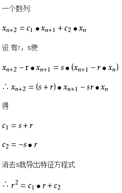
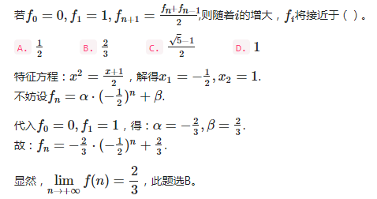

### 通用方法

有递推关系：an = c1an-1 + c2an-2 + ... + cpan-p   ①

其中，p ≤ n,   c1 ,c2, ... cp是常数，且 cp ≠ 0，则称为常系数线性齐次递推关系(所有的ak的项都是一次幂）。

一旦我们给出前P个项a0,a1,...,ap-1的值，递推关系 ①式有唯一解，这些值形成为初始条件，根据a0,a1,...,ap-1的值，我们能确定ap, 于是根据a0,a1,...,ap-1,ap的值，能确定ap+1，以此类推。

一般地，如果忽略初始条件，那式将会有很多解。其中的某些解将是形如下面的序列：

m0,m1,m2,...,mn,...	②

其中m是一个数，从确定是式称为式的一个解的m值开始。

在 ①式中，用xk替换ak, 并求解x,

xn=c1xn-1 - c2xn-2 - ...- cpxn-p	③

③式两边同时除以xn-p得：

xp - c1xp-1 - c2xp-2 -...- cpx0 = 0	④

④式为递推关系 ①式的特征方程，该方程是一个x的p次多项式，所以有p个根，其中某些根可能是重根，或者是复数，这些根称为递推关系式的特征根。

例：an = 5an-1 - 6an-2  ⑤   且a0=1,a1=1;

特征方程：x2 - 5x + 6 = 0

## a1=2, a2=3是特征根

### 例题

