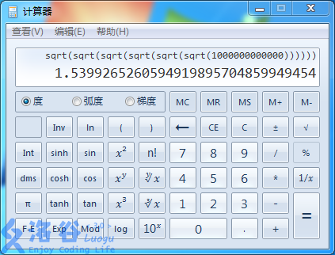

[花神游历各国](https://www.lydsy.com/JudgeOnline/problem.php?id=3211)
可以知道这个开方操作进行了一定的次数就会等于1了，如下图所示



这样我们只要记录这个区间的最大值，如果最大值大于1，则可以继续开平方，否则就返回啦，**重要的是这里把pushdown当做了开平方操作用**

```cpp
#include<cstdio>
#include<cmath>
#define MAXN 100005
#define FOR(i,n) for(int i = 1;i <= n;i++)
#define ls (o << 1)
#define rs ((o << 1) + 1)
#define M ((L + R) >> 1)
#define max(a,b) (a > b ? a : b)
typedef long long ll;
using namespace std;
int read(){
	char c = getchar();
	while(c < '0' || '9' < c){
		c = getchar();
	}
	int x = 0;
	while('0' <= c && c <= '9'){
		x = 10 * x + c - '0';
		c = getchar();
	}
	return x;
}
int buf[20];
void printf(ll x){
	buf[0] = 0;
	if(x == 0){
		buf[0] = 1;
	}else{
		if(x < 0){
			putchar('-');
			x = -x;
		}
		while(x){
			buf[++buf[0]] = x % 10;
			x /= 10;
		}
	}
	for(int i = buf[0];i;i--)
		putchar(buf[i] + '0');
	puts("");
}
int n,m,a[MAXN],maxv[MAXN << 2];
ll sumv[MAXN << 2];

void pushup(int o){//普通pushup 
	sumv[o] = sumv[ls] + sumv[rs];
	maxv[o] = max(maxv[ls],maxv[rs]);
}

void pushdown(int o,int L,int R){//把pushdown当做开根操作 
	if(maxv[o] <= 1)
		return;
	if(L == R){
		sumv[o] = maxv[o] = sqrt(sumv[o]);
		return;
	}
	pushdown(ls,L,M);//分到左节点开根 
	pushdown(rs,M + 1,R);//分到右节点开根 
	pushup(o);//更新一下 
}
int ql,qr;
ll query(int o,int L,int R){
	if(ql <= L && R <= qr){
		return sumv[o];
	}
	ll ans = 0;
	if(ql <= M)
		ans += query(ls,L,M);
	if(M < qr)
		ans += query(rs,M + 1,R);
	return ans;
}
int lc,rc,v;
void changes(int o,int L,int R){
	if(lc <= L && R <= rc){
		pushdown(o,L,R);//开平方操作 
		return;
	}
	if(lc <= M)
		changes(ls,L,M);
	if(M < rc)
		changes(rs,M + 1,R);
	pushup(o);
}

void build(int o,int L,int R){
	if(L == R){
		sumv[o] = maxv[o] = a[L];
		return;
	}
	build(ls,L,M);
	build(rs,M + 1,R);
	pushup(o);
}

int main(){
	n = read();
	FOR(i,n){
		a[i] = read();
	}
	build(1,1,n);//建树 
	m = read();
	FOR(i,m){
		if(read() == 1){
			ql = read();
			qr = read();
			printf(query(1,1,n));
		}else{
			lc = read();
			rc = read();
			changes(1,1,n);
		}
	}
	return 0;
}
```