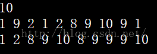

**lower_bound( )和upper_bound( )都是利用二分查找的方法在一个排好序的数组中进行查找的。**

在从小到大的排序数组中，

lower_bound( begin,end,num)：从数组的begin位置到end-1位置二分查找第一个大于或等于num的数字，找到返回该数字的地址，不存在则返回end。通过返回的地址减去起始地址begin,得到找到数字在数组中的下标。

upper_bound( begin,end,num)：从数组的begin位置到end-1位置二分查找第一个大于num的数字，找到返回该数字的地址，不存在则返回end。通过返回的地址减去起始地址begin,得到找到数字在数组中的下标。

在从大到小的排序数组中，重载lower_bound()和upper_bound()

lower_bound( begin,end,num,greater<type>() ):从数组的begin位置到end-1位置二分查找第一个小于或等于num的数字，找到返回该数字的地址，不存在则返回end。通过返回的地址减去起始地址begin,得到找到数字在数组中的下标。

upper_bound( begin,end,num,greater<type>() ):从数组的begin位置到end-1位置二分查找第一个小于num的数字，找到返回该数字的地址，不存在则返回end。通过返回的地址减去起始地址begin,得到找到数字在数组中的下标。

```cpp
#include<bits/stdc++.h>
using namespace std;
const int maxn=100000+10;
const int INF=2*int(1e9)+10;
#define LL long long
int cmp(int a,int b){
	return a>b;
}
int main(){
	int num[6]={1,2,4,7,15,34}; 
	sort(num,num+6);                           //按从小到大排序 
	int pos1=lower_bound(num,num+6,7)-num;    //返回数组中第一个大于或等于被查数的值 
	int pos2=upper_bound(num,num+6,7)-num;    //返回数组中第一个大于被查数的值
	cout<<pos1<<" "<<num[pos1]<<endl;
	cout<<pos2<<" "<<num[pos2]<<endl;
	sort(num,num+6,cmp);                      //按从大到小排序
	int pos3=lower_bound(num,num+6,7,greater<int>())-num;  //返回数组中第一个小于或等于被查数的值 
	int pos4=upper_bound(num,num+6,7,greater<int>())-num;  //返回数组中第一个小于被查数的值 
	cout<<pos3<<" "<<num[pos3]<<endl;
	cout<<pos4<<" "<<num[pos4]<<endl;
	return 0;	
} 

```

**unique()是C++标准库函数里面的函数，其功能是去除相邻的重复元素（只保留一个），所以使用前需要对数组进行排序，和上面一样减去初始位置即可得到长度**

上面的一个使用中已经给出该函数的一个使用方法，对于长度为n数组a，unique(a,a+n) - a返回的是去重后的数组长度

那它是怎么实现去重的呢？删除？

不是，它并没有将重复的元素删除，而是把重复的元素放到数组的最后面藏起来了

```cpp
#include<iostream>
#include<cstdio>
#include<algorithm>
using namespace std;
const int N = 100000;
int a[N+5];
int main()
{
    int n;
    while (cin>>n)
    {
        for (int i = 0;i < n;++i)
        {
            scanf("%d",&a[i]);
        }
        sort(a,a+n);
        n = unique(a,a+n) - a;//关键的一句
        for (int i = 0;i < n;++i)
        {
            printf("%d ",a[i]);
        }
        puts("");
    }
    return 0;
}

```
实例
```cpp
while (cin>>n)
    {
        for (int i = 0;i < n;++i)
        {
            scanf("%d",&a[i]);
        }
        sort(a,a+n);
        int k = unique(a,a+n) - a;
        for (int i = 0;i < n;++i)
        {
            printf("%d ",a[i]);
        }
        puts("");
    }
```
