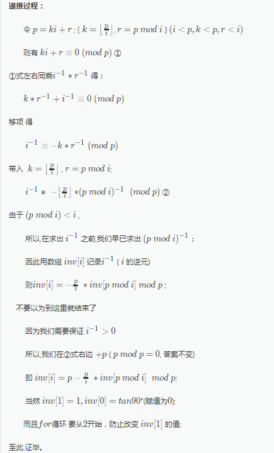

```cpp
#include<cstdio>
#define ll long long
using namespace std;
const int maxn=3e6+5;
ll inv[maxn]={0,1};
int main(){
    int n,p;
    scanf("%d%d",&n,&p);
    printf("1\n");
    for(int i=2;i<=n;i++)
        inv[i]=(ll)p-(p/i)*inv[p%i]%p,printf("%d\n",inv[i]);
    return 0;
}
```