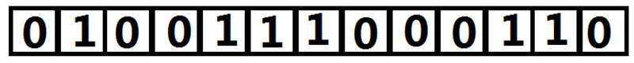

倒序构造法：对于构造最终序列，可以使用倒序的方法来反向模拟数的插入过程。可以理解我们现将所有数放进来，然后一个个拔出去。我们用一个数组表示：如果这个数还没有被拔出去，那么数组这一位为1，否则为0。如图：假设现在应该拔出a[i](即输入的：数字i插入到i位置上)



那么它在哪里？我们就在这个数组中查找第一个前缀和等于i的位置，那里就是它的真实位置（注意这里的i可以理解为第i个插入的），所以这一步我们使用二分法加一个维护前缀的东西就可以完成（偷懒就用个STL bound挺好的）。我们又一次的到了最终序列，然后就随意DP+优化就完成了。

```cpp
#include<cstdio>
#define max(a,b) (a > b ? a : b)
#define lowbit(x) (x & -x)
#define MAXN 100005
int n,a[MAXN],f[MAXN],c[MAXN];
int find(int p){
	int ans = 0;
	for(;p > 0;p -= lowbit(p)){
		ans += c[p];
	}
	return ans;
}
void add(int p,int x){
	for(;p <= n;p += lowbit(p)){
		c[p] += x;
	}
}
inline void Up(int x,int d){
	while(x<=n){
		c[x]=max(c[x],d);
		x+=lowbit(x);
	}
}
inline int Max(int x){
	int M=0;
	while(x)M=max(M,c[x]),x-=lowbit(x);
	return M;
}
int main(){
	scanf("%d",&n);
	for(int i = 1;i <= n;i++){
		scanf("%d",a + i);
		add(i,1);
	}
	for(int i = n;i;i--){
		int l = 1,r = n;
		while(l < r){
			int mid = (l + r) >> 1;
			if(find(mid) < a[i] + 1){
				l = mid + 1;
			}else{
				r = mid;
			}
		}
		add(a[i] = r,-1);
	}
	for(int i = 1;i <= n;i++){
		Up(a[i],f[i] = Max(a[i]) + 1);
		f[i]=max(f[i],f[i-1]);
		printf("%d\n",f[i]);
	}
	return 0;
}
```