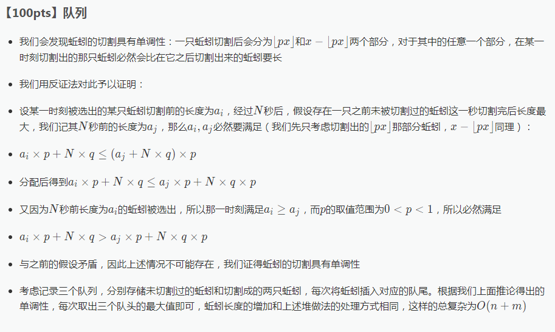

[Link](https://www.luogu.org/problemnew/show/P2827)

堆非常容易想出来，注意是要注意这个切蚯蚓是有单调性的，分别用三个队列维护原来的蚯蚓，分别切开两半的蚯蚓。



```cpp
#include <iostream>
#include <cstdio>
#include <algorithm>
#include <cmath>

using namespace std;
typedef long long ll;
const int Maxn = 2147483647;
const int N = 1e5 + 5, M = 7e6 + 5;
int n, m, q, u, v, t, Add;
int Q[3][M], qt[3], qw[3]; 

inline int get()
{
    char ch; int res;
    while ((ch = getchar()) < '0' || ch > '9');
    res = ch - '0';
    while ((ch = getchar()) >= '0' && ch <= '9')
     res = (res << 3) + (res << 1) + ch - '0';
    return res;
}

inline void put(int x)
{ 
    if (x > 9) put(x / 10);
    putchar(x % 10 + 48); 
}

inline bool cmp(const int &x, const int &y) {return x > y;}

inline int GetMax()
{
    int res = -Maxn, k;
    for (int i = 0; i < 3; ++i)
     if (qt[i] < qw[i] && res < Q[i][qt[i] + 1])
      res = Q[i][qt[i] + 1], k = i;
    qt[k]++; return res;
}

int main()
{
    n = get(); m = get(); q = get(); 
    u = get(); v = get(); t = get();
    for (int i = 1; i <= n; ++i) Q[0][++qw[0]] = get(); 
    sort(Q[0] + 1, Q[0] + qw[0] + 1, cmp);
    for (int i = 1; i <= m; ++i)
    {
        int x = GetMax() + Add;
         if (i % t == 0) put(x), putchar(i + t > m ? '\n' : ' '); 
        int l = (ll)x * u / v, r = x - l; 
        Q[1][++qw[1]] = l - Add - q;
        Q[2][++qw[2]] = r - Add - q; Add += q; 
    }
    if (t > m) putchar('\n');
    int tmp = n + m;
    for (int i = 1; i <= tmp; ++i)
    {
        int x = GetMax() + Add;
         if (i % t == 0) {put(x); if (i + t <= tmp) putchar(' ');}
    }
    return 0;
}
/*
#include<cstdio>
#include<cstring>
#define MAXN 8000000
#define fa (now >> 1)
#define L (now << 1)
#define R ((now << 1) + 1)
using namespace std;
int heap[MAXN << 1],last;
void swap(int & a,int & b){
	int t = a;
	a = b;
	b = t;
}
int read(){
	char c = getchar();
	while(c < '0' || '9' < c)
		c = getchar();
	int x = 0;
	while('0' <= c && c <= '9'){
		x = 10 * x + c - '0';
		c = getchar();
	}
	return x;
}
void printf(int x){
	if(x < 10)
		putchar(x + '0');
	else{
		printf(x / 10);
		putchar(x % 10 + '0');
	}
}
int gets(){
	int x = heap[1],now = 1,next;
	heap[1] = heap[last];
	heap[last--] = ~0x3f3f3f3f;
	while(now != last){
		if(L == last){
			next = L;
		}else{
			if(heap[L] >= heap[R]){
				next = L;
			}else{
				next = R;
			}
		}
		if(heap[now] < heap[next]){
			swap(heap[now],heap[next]);
			now = next;
		}else{
			break;
		}
	}	
	return x;
}
void insert(int x){
	int now = ++last;
	//printf("%d\n",now);
	heap[now] = x;
	while(now != 1){
		if(heap[now] > heap[fa]){
			swap(heap[now],heap[fa]);
			//printf("%d %d %d\n",now,fa,x);
			now = fa;
		}else{
			break;
		}
	}
	//puts("");
}
int n,m,q,u,v,t,x,tot,a,b;
int main(){
	//freopen("testdata.in","r",stdin);
	//freopen("testdata.out","w",stdout);
	memset(heap,~0x3f,sizeof(heap));
	n = read();
	m = read();
	q = read();
	u = read();
	v = read();
	t = read();
	for(int i = 1;i <= n;i++){
		x = read();
		insert(x);
	}
	double p = (double)u / v;
	for(int i = 1;i <= m;i++){
		x = gets();
		a = p * (x + tot);
		b = x + tot - a;
		if(i % t == 0){
			printf(x + tot);
			putchar(char(32));
		}
		insert(a - tot - q);
		insert(b - tot - q);
		tot += q;
	}
	puts("");
	for(int i = 1;i <= n + m;i++){
		x = gets();
		if(i % t == 0){
			printf(x + tot);
			putchar(char(32));
		}
	}
	puts("");
	return 0;
}
*/
```