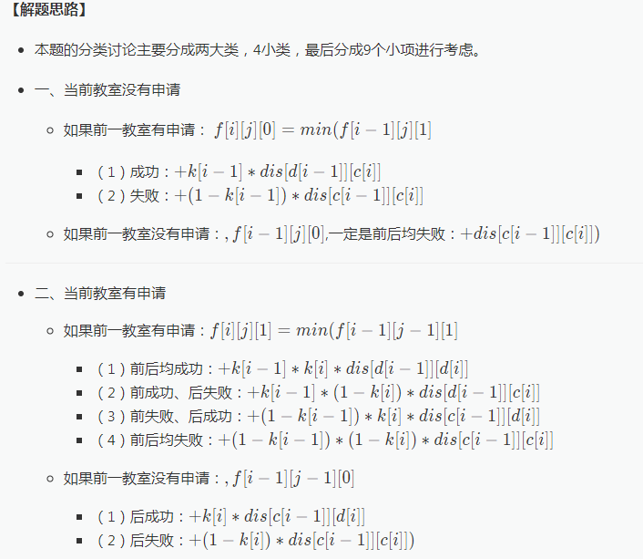

还有极大值极小值

>**int**
”较“的原则：加法不爆。 
极大值：0x7f 
较大值：0x3f 
较小值：0xc0 
极小值：0x80

>**long long**
”较“的原则：加法不爆。 
极大值：0x7f 
较大值：0x3f 
较小值：0xc0 
极小值：0x80

>**float**
”较“的原则：保证一定位精度。 
7f以上一直到be都是-0 (实际上是一个很小的>-1.0的负数) 
极大值：0x7f 
较大值：0x4f 
较小值：0xce 
极小值：0xfe 
0xff是 -1.#QNAN0000…… (-∞？)

>**double**
”较“的原则：保证一定位精度。 
极大值：0x7f 
较大值：0x43 
较小值：0xc2 
极小值：0xfe

自己一开始有这样的思路，但是不够灵光，下次做这类题应该大胆设想！

还有就是需要考虑弗洛伊德的重边情况，要选择最小的边！！！！



```cpp
#include<cstdio>
#include<cstring>
#include<algorithm>
#define MAXV 305
#define MAXN 2005
using namespace std;
int n,m,v,e,c[MAXN],d[MAXN];
double k[MAXN],f[MAXN][MAXN][2];
int G[MAXV][MAXV];
int main(){
	//freopen("testdata.in","r",stdin);
	scanf("%d%d%d%d",&n,&m,&v,&e);
	for(int i = 1;i <= n;i++)
		scanf("%d",c + i);
	for(int i = 1;i <= n;i++)
		scanf("%d",d + i);
	for(int i = 1;i <= n;i++){
		scanf("%lf",k + i);//成功的概率
	}
	memset(G,0x3f,sizeof(G));
	for(int i = 1;i <= e;i++){
		int x,y,z;
		scanf("%d%d%d",&x,&y,&z);
		G[x][y] = min(G[x][y],z);
		G[y][x] = G[x][y];
	}
	for(int i = 1;i <= v;i++)
		G[i][i] = 0;
	for(int p = 1;p <= v;p++){
		for(int i = 1;i <= v;i++){
			for(int j = 1;j <= v;j++){
				G[i][j] = min(G[i][j],G[i][p] + G[p][j]);
			}
		}
	}
	memset(f,0x7f,sizeof(f));
	f[1][0][0] = f[1][1][1] = 0;
	for(int i = 2;i <= n;i++){
		for(int j = 0;j <= m;j++){
			f[i][j][0] = min(f[i - 1][j][0] + G[c[i - 1]][c[i]],
			f[i - 1][j][1] + k[i - 1] * G[d[i - 1]][c[i]] + (1 - k[i - 1]) * G[c[i - 1]][c[i]]);
			
			if(j != 0)
				f[i][j][1] = min(f[i - 1][j - 1][1] 
				+ k[i - 1] * k[i] * G[d[i - 1]][d[i]]
				+ k[i - 1] * (1 - k[i]) * G[d[i - 1]][c[i]]
				+ (1 - k[i - 1]) * k[i] * G[c[i - 1]][d[i]]
				+ (1 - k[i - 1]) * (1 - k[i]) * G[c[i - 1]][c[i]]
				,f[i - 1][j - 1][0] + k[i] * G[c[i - 1]][d[i]] + (1 - k[i]) * G[c[i - 1]][c[i]]);
		}
	}
	double ans = 0x3f3f3f3f;
	for(int j = 0;j <= m;j++){
		ans = min(ans,min(f[n][j][0],f[n][j][1]));
	}
	printf("%.2lf\n",ans);
	return 0;
}
```