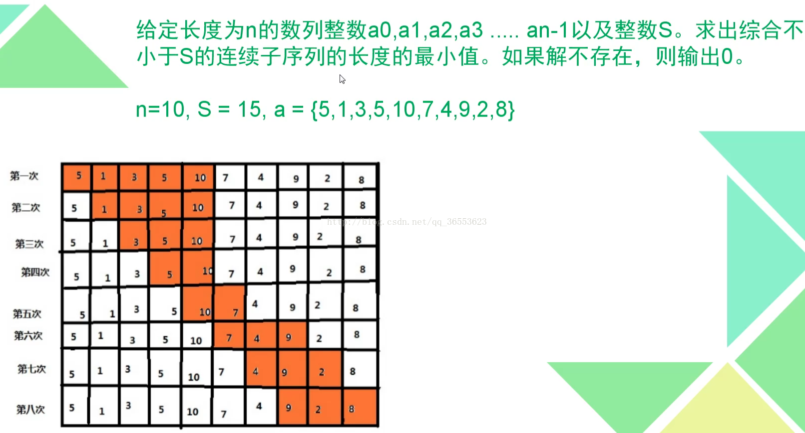
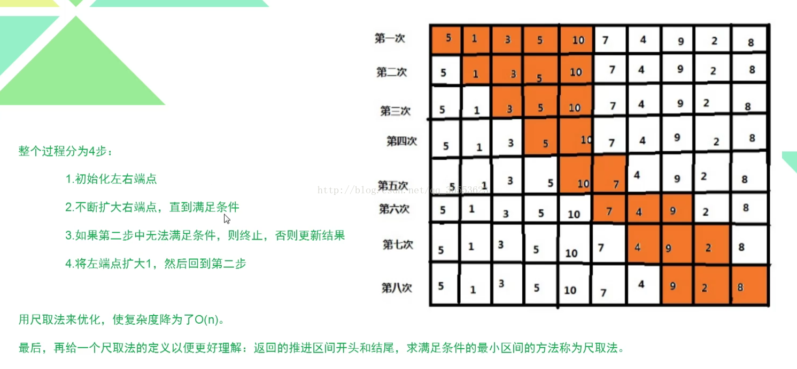

>==**题目描述**农夫约翰的N(1 <= N <= 100,000)只奶牛排成了一队，每只牛都用编上了一个“血统编号”，该编号为范围0...1,000,000,000的整数。血统相同的奶牛有相同的编号，也就是可能有多头奶牛是相同的"血统编号"。
约翰觉得如果连续排列的一段奶牛有相同的血统编号的话，奶牛们看起来会更具有威猛。为了创造这样的连续段，约翰最多能选出k种血统的奶牛，并把他们全部从队列中赶走。
请帮助约翰计算这样做能得到的由相同血统编号的牛构成的连续段的长度最大是多少？==

其实可以分析出来，对于一个区间内，它的颜色总数小于等于k + 1时候，他的最大连续就是它最多的那一个
这样我们就可以先离散化，然后在用尺取法，选定左端点，不断扩展（有点像单调队列），下面贴代码

``` cpp
#include<cstdio>
#include<map>
#define MAXN 100005
using namespace std;
int read(){
	char c = getchar();
	while(c < '0' || '9' < c)
		c = getchar();
	int x = 0;
	while('0' <= c && c <= '9'){
		x = 10 * x + c - '0';
		c = getchar();
	}
	return x;
}
map<int,int> mp;
//离散化
int a[MAXN];
//存离散化后的数组
int hav[MAXN];
//存当前区间内，对应数字出现过的次数
int mxl;
//离散化值
int typ,k;//当前区间里有多少种
int ans,n;
int main(){
    n = read();
	k = read();
    for(int i=1;i<=n;i++){
        a[i] = read();
        if(!mp.count(a[i]))mp[a[i]]=++mxl;
        //如果当前数字没有出现过，就给他分配一个新的离散化值
        a[i]=mp[a[i]];
    }
    int l=1,r=0;
    //区间
    while(r<=n){//尺取法
        r++;
        //右移
        if(!hav[a[r]])typ++;//如果这个数字第一次出现，颜色种类
        hav[a[r]]++;//对应颜色加一
        while(typ==k+2){
        //删除k种，说白了允许当前区间内有k+1种如果是k+2种就得删除了
			hav[a[l]]--;
        //左界右移，减少左界位置上值得数量
		if(hav[a[l]]==0)typ--;//没了就颜色数--
			l++;
        }
        ans=max(ans,hav[a[r]]);
        //统计答案
    }
    printf("%d",ans);
}
```


> 尺取法：顾名思义，像尺子一样取一段，借用挑战书上面的话说，尺取法通常是对数组保存一对下标，即所选取的区间的左右端点，然后根据实际情况不断地推进区间左右端点以得出答案。之所以需要掌握这个技巧，是因为尺取法比直接暴力枚举区间效率高很多，尤其是数据量大的时候，所以尺取法是一种高效的枚举区间的方法，一般用于求取有一定限制的区间个数或最短的区间等等。当然任何技巧都存在其不足的地方，有些情况下尺取法不可行，无法得出正确答案。


***==例子：==***





==使用尺取法时应清楚以下四点：1、  什么情况下能使用尺取法?  2、何时推进区间的端点？ 3、如何推进区间的端点？ 3、何时结束区间的枚举？ 尺取法通常适用于选取区间有一定规律，或者说所选取的区间有一定的变化趋势的情况，通俗地说，在对所选取区间进行判断之后，我们可以明确如何进一步有方向地推进区间端点以求解满足条件的区间，如果已经判断了目前所选取的区间，但却无法确定所要求解的区间如何进一步得到根据其端点得到，那么尺取法便是不可行的。首先，明确题目所需要求解的量之后，区间左右端点一般从最整个数组的起点开始，之后判断区间是否符合条件在根据实际情况变化区间的端点求解答案。==


题目：
[POJ2739](http://poj.org/problem?id=2739)
[POJ3061](http://poj.org/problem?id=3061)
[POJ3320](http://poj.org/problem?id=3320)
[POJ2566](http://poj.org/problem?id=2566)
[POJ2100](http://poj.org/problem?id=2100)
**==*留坑待填* 2018年10月08日 11时52分49秒==**


**总结：尺取法的模型便是这样：根据区间的特征交替推进左右端点求解问题，其高效的原因在于避免了大量的无效枚举，其区间枚举都是根据区间特征有方向的枚举，如果胡乱使用尺取法的话会使得枚举量减少，因而很大可能会错误，所以关键的一步是进行问题的分析！**