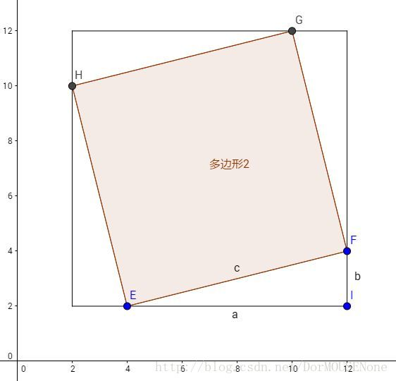

**n×n 点阵中内接正方形个数**

如上图所示，边长为 n 的正方形的内接正方形必须满足须满足 a^2 + b^2 = c^2 且  a+b=n ，同时，要求顶点必须为点阵中的点，故 a，b 的取值均为整数。

以 n=10 的点阵举例，其取值的可能情况为 [0, 10] , [1, 9] , …, [9, 1], [10, 0] ([A, B]表示 a = A，b=B 的情况)。其中除了 [0, 10] 与 [10, 0] 产生的内接正方形相同，其余均各不相同。故对于 n×n 的点阵，其不同的内接正方形的个数为 n 个。

n×m 点阵中内接正方形个数
统计 n×m 点阵中内接正方形个数，可以将其依次分解为 1×1 , 2×2 , …, n×n 的正方形（此处假设 n≤m ），求其内接正方形的个数再求和。

n×m 点阵中 1×1 的正方形有 n×m 个。
n×m 点阵中 2×2 的正方形有 (n−1)×(m−1) 个。
…
n×m 点阵中 n×n 的正方形有 1×(m−n+1) 个。
即在 n×m 点阵中 i×i 的正方形有 i × (n−i+1)×(m−i+1) 个。

故总个数为：Σ(n−i+1)×(m−i+1)×i
化简过程比较烦躁，不表。

ans = n^4/12−n^2/12 + (m−n)∗(n^3/6−n/6)